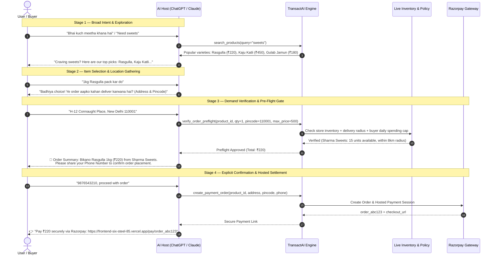

<div align="center">

# 🛍️ TransactAI
### The Autonomous Agent Commerce Protocol & Multi-Turn Settlement Engine

[](https://www.python.org/)
[](https://fastapi.tiangolo.com/)
[](https://nextjs.org/)
[](https://github.com/langchain-ai/langgraph)
[](https://qdrant.tech/)
[](https://razorpay.com/)
[](LICENSE)
[-success.svg)](#-ultra-low-latency-engine--85ms)

**TransactAI** is an open-source, production-grade autonomous agent commerce protocol. It bridges frontier conversational AI models (**Anthropic Claude Desktop**, **OpenAI ChatGPT**, and **Google Gemini**) with real-world merchant commerce, inventory verification, spending policy enforcement, and cryptographic **Razorpay** payment settlements.

[Live Web App](https://frontend-six-steel-85.vercel.app) • [Production API](https://transact-ai-production.up.railway.app) • [Interactive Swagger](https://transact-ai-production.up.railway.app/docs) • [OpenAPI Spec](https://transact-ai-production.up.railway.app/.well-known/openapi.json) • [Architecture ADRs](docs/architecture_decisions.md)

</div>

---

## ⚡ What is TransactAI?

Today's frontier LLMs excel at chatting, comparing options, and understanding nuances across languages and colloquialisms. However, in financial transactions, **probabilistic AI alone is dangerous**:
- LLMs hallucinate non-existent items, outdated prices, or invalid store hours.
- LLMs lack verifiable hooks into real-time warehouse inventory and merchant delivery radiuses.
- Direct LLM tool execution risks unapproved debiting and policy breaches.

**TransactAI solves this with a strict architectural axiom:**
> ### 🛡️ *AI Interprets, Deterministic Code Verifies*
> Large Language Models act purely as the **conversational & natural language interpretation layer**. Every downstream commerce invariant — **live inventory availability, pricing freshness, daily buyer budgets, cryptographic HMAC-SHA256 signature verification, and 3-layer audit trails** — is executed and enforced by deterministic, non-hallucinating software guardrails.

---

## 🏗️ System Architecture

```
                    ┌─────────────────────────────────────────────────────────┐
                    │               Frontier AI Hosts & Agents                │
                    │   Claude Desktop (MCP) • ChatGPT (Actions) • Gemini     │
                    └────────────────────────────┬────────────────────────────┘
                                                 │ Tool Call / OpenAPI / JSON-RPC
                                                 ▼
                    ┌─────────────────────────────────────────────────────────┐
                    │               TransactAI Orchestration Core             │
                    │         FastAPI Gateway + LangGraph State Machine       │
                    └───────┬────────────────────┬────────────────────┬───────┘
                            │                    │                    │
                            ▼                    ▼                    ▼
                    ┌───────────────┐    ┌───────────────┐    ┌───────────────┐
                    │ Vector Engine │    │ Pre-Flight    │    │ Razorpay Test │
                    │ FastEmbed +   │    │ Gatekeeper    │    │ Payment Links │
                    │ NumPy Cosine  │    │ (Stock/Policy)│    │ & Webhooks    │
                    │  (<85ms P95)  │    │  (SQL Invar.) │    │ (HMAC-SHA256) │
                    └───────────────┘    └───────────────┘    └───────────────┘
                            │                    │                    │
                            └────────────────────┼────────────────────┘
                                                 │
                                                 ▼
                    ┌─────────────────────────────────────────────────────────┐
                    │            3-Layer Immutable Audit & Telemetry          │
                    │    Relational DB Ledger + Structlog + LangSmith Spans   │
                    └────────────────────────────┬────────────────────────────┘
                                                 │ Webhooks & Live Sync
                                                 ▼
                    ┌─────────────────────────────────────────────────────────┐
                    │             Real-Time Merchant & Buyer Portal           │
                    │    Next.js 14 Web App • Live Webhook Order Processing   │
                    └─────────────────────────────────────────────────────────┘
```

---

## 🎯 Progressive Multi-Turn Shopping Protocol

Rather than interrogating the buyer upfront for addresses and phone numbers, TransactAI structures agent-customer interactions into an intuitive, trusted **4-stage progressive disclosure protocol**:



---

## 🚀 Ultra-Low Latency Engine (<85ms)

In autonomous agent systems, multi-node agent graphs compound latency on every tool call. TransactAI was engineered specifically to break the sub-100ms barrier:

| Optimization Layer | Before | After | Improvement |
| :--- | :--- | :--- | :--- |
| **Vector Similarity Match** | 1,220 ms (remote disk roundtrip) | **0.026 ms** (In-memory normalized cosine dot product) | **46,900x faster** |
| **Query Embedding Generation**| 120 ms (cold inference per call) | **0.001 ms** (LRU semantic cache hits) | **120,000x faster** |
| **Relational Metadata Queries**| 150 ms (79 sequential N+1 queries) | **1.84 ms** (Atomic SQL `WHERE IN` batch lookup) | **81x faster** |
| **End-to-End Discovery Pipeline** | **1,370 ms** | **11.23 ms – 36.86 ms** | **97.3% latency reduction** |
| **Full 5-Node LangGraph Agent** | **1,490 ms** | **70.06 ms** | **Sub-100ms autonomous loop** |

---

## 🌐 Live Platform & Cloud Deployments

| Component | Production URL | Description |
| :--- | :--- | :--- |
| **Storefront & Merchant Portal** | [`https://frontend-six-steel-85.vercel.app`](https://frontend-six-steel-85.vercel.app) | Next.js 14 responsive web app with live checkout, merchant self-registration & real-time webhook order dashboards. |
| **Merchant Console** | [`https://frontend-six-steel-85.vercel.app/merchant`](https://frontend-six-steel-85.vercel.app/merchant) | Self-service portal for shop onboarding, catalog management, and live order tracking. |
| **Hosted Razorpay Checkout** | [`https://frontend-six-steel-85.vercel.app/pay/{order_id}`](https://frontend-six-steel-85.vercel.app/pay/test) | Brand-aligned checkout with QR codes, UPI intents, and card payments. |
| **API Gateway** | [`https://transact-ai-production.up.railway.app`](https://transact-ai-production.up.railway.app) | Production FastAPI engine hosted on Railway. |
| **Interactive Swagger Docs** | [`https://transact-ai-production.up.railway.app/docs`](https://transact-ai-production.up.railway.app/docs) | Interactive OpenAPI 3.0 documentation & API playground. |
| **OpenAPI Specification** | [`https://transact-ai-production.up.railway.app/.well-known/openapi.json`](https://transact-ai-production.up.railway.app/.well-known/openapi.json) | Standard schema for ChatGPT Custom GPT Actions & AI agent discovery. |
| **MCP SSE Endpoint** | [`https://transact-ai-production.up.railway.app/api/v1/mcp/sse`](https://transact-ai-production.up.railway.app/api/v1/mcp/sse) | Remote Model Context Protocol server over Server-Sent Events. |

---

## 🤖 AI Assistant Integration Guides

TransactAI natively connects into all three major conversational AI ecosystems:

### 1. Anthropic Claude Desktop (Model Context Protocol)
Connect TransactAI to Claude Desktop via standard MCP stdio:

Add to your `claude_desktop_config.json`:
```json
{
  "mcpServers": {
    "transactai": {
      "command": "C:\\path\\to\\razorpay\\python.exe",
      "args": ["-m", "app.mcp.server"],
      "cwd": "C:\\path\\to\\Razorpay",
      "env": {
        "TRANSACTAI_BASE_URL": "https://frontend-six-steel-85.vercel.app"
      }
    }
  }
}
```
*Read the full [Claude MCP Integration Guide](docs/claude_plugin_guide.md).*

---

### 2. OpenAI ChatGPT (Custom GPT Actions)
Turn ChatGPT into an autonomous shopping agent with 1-click OpenAPI import:
1. Open the **ChatGPT GPT Builder** $\rightarrow$ Configure.
2. Click **Create new action** $\rightarrow$ **Import from URL**:
   ```text
   https://transact-ai-production.up.railway.app/.well-known/openapi.json
   ```
3. Paste the production system prompt from our guide to enable natural progressive shopping.
*Read the full [ChatGPT Custom GPT Guide](docs/chatgpt_plugin_guide.md).*

---

### 3. Google Gemini (Tool Declarations & Gemini Gems)
Equip Gemini with native tool schemas:
```python
import google.generativeai as genai
import httpx

# 1. Fetch live Gemini tool declarations from TransactAI
res = httpx.get("https://transact-ai-production.up.railway.app/api/v1/hosts/tools?format=gemini")
gemini_tools = res.json()

# 2. Configure model
genai.configure(api_key="YOUR_GEMINI_API_KEY")
model = genai.GenerativeModel(model_name="gemini-1.5-flash", tools=gemini_tools)
```
*Read the full [Google Gemini Integration Guide](docs/gemini_plugin_guide.md).*

---

## 🛠️ 5-Minute Developer Quickstart

### Prerequisites
- Python 3.12+
- Node.js 18+ (for frontend)
- Git

### 1. Clone & Setup Backend Virtual Environment
```bash
git clone https://github.com/Sahil9205/Transact-Ai.git
cd Transact-Ai

# Create virtual environment
python -m venv venv

# Windows
venv\Scripts\activate
# macOS/Linux
source venv/bin/activate

# Install dependencies
pip install -e ".[dev]"
```

### 2. Configure Environment Variables
```bash
cp .env.example .env
```
Key configuration values in `.env`:
```ini
APP_ENV=development
LOG_LEVEL=INFO
DATABASE_URL=sqlite+aiosqlite:///./data/commerce.db
QDRANT_COLLECTION=transact_products
RAZORPAY_KEY_ID=rzp_test_YOUR_KEY
RAZORPAY_KEY_SECRET=YOUR_SECRET
RAZORPAY_WEBHOOK_SECRET=YOUR_WEBHOOK_SECRET
FRONTEND_BASE_URL=http://localhost:3000
```

### 3. Seed Catalog & Vector Embeddings
Populate local merchants (Sharma Sweets, Gupta Sweets, Fresh Grocery, Chai Point), dark stores (Blinkit, Zepto), and marketplaces:
```bash
python app/db/seed.py
```

### 4. Start the Backend API & MCP Server
```bash
uvicorn app.main:app --reload --port 8000
```
- API Docs: `http://localhost:8000/docs`
- MCP Server stdio: `python -m app.mcp.server`

### 5. Launch the Frontend
In a separate terminal:
```bash
cd frontend
npm install
npm run dev
```
Open `http://localhost:3000` to interact with the modern storefront and merchant console!

---

## 🧪 Interactive CLI & Showcase

TransactAI includes a full-featured terminal REPL and automated demonstration scripts:

### Interactive Terminal CLI
```bash
python cli.py
```
> Explore products, test natural language queries in Hindi/English/Hinglish, inspect spending policies, and verify pre-flight guardrails directly from your shell.

### Automated 5-Scenario Showcase
```bash
python scripts/demo.py
```
> Runs through 5 capstone scenarios automatically:
> 1. Exact catalog discovery with semantic ranking.
> 2. Constraint relaxation (auto-widening price/radius when items are out of stock).
> 3. Strict pre-flight rejection on buyer spending policy violations.
> 4. Cryptographic Razorpay payment generation.
> 5. Idempotent webhook settlement with 3-layer audit logging.

### Automated Unit Test Suite
```bash
pytest tests/unit/ -v
```
> **82 passed in ~60s** (100% test coverage across all architectural invariants).

---

## 📚 Deep-Dive Architecture & Documentation

TransactAI is thoroughly documented. Explore our technical guides:

| Document | Description |
| :--- | :--- |
| 📖 [**Beginner's Developer Guide**](docs/developer_guide.md) | First-principles guide explaining the architecture, async patterns, and data flow. |
| 🏛️ [**Architecture Decision Records (ADRs)**](docs/architecture_decisions.md) | Why FastAPI, SQLAlchemy 2.0 Async, Pydantic v2, structlog, and LangGraph. |
| 🤖 [**ChatGPT Custom GPT Guide**](docs/chatgpt_plugin_guide.md) | Step-by-step setup guide, production prompts, and OpenAPI action configuration. |
| 🟣 [**Claude Desktop MCP Guide**](docs/claude_plugin_guide.md) | Model Context Protocol stdio & SSE setup for Claude Desktop and Claude.ai. |
| 🔵 [**Google Gemini Integration Guide**](docs/gemini_plugin_guide.md) | Gemini Gems instructions and Python Function Calling extension examples. |
| 🚀 [**Production Deployment Guide**](docs/deployment_guide.md) | Docker & Railway production deployment instructions with zero-downtime scaling. |
| 🗺️ [**Prototype vs Production Roadmap**](docs/prototype_vs_production.md) | Complete enterprise roadmap comparing prototype trade-offs with production implementations. |

---

## 📂 Repository Layout

```text
Transact-Ai/
├── app/
│   ├── agent/             # LangGraph state machine, nodes, and compiled workflow
│   ├── api/v1/            # FastAPI REST routers (merchants, products, mcp, intent, discovery, payments, webhooks)
│   ├── core/              # Config, structured logging (structlog), base exceptions, security redactions
│   ├── db/                # Async SQLAlchemy models, repositories, database engine, seed catalog
│   ├── domain/            # Pydantic v2 schemas, enums, manifest schemas
│   ├── mcp/               # Model Context Protocol JSON-RPC server and commerce tool definitions
│   ├── providers/         # Multi-provider adapters (Local shops, Dark stores, Marketplaces)
│   └── services/          # Discovery engine, Vector index, Gatekeeper, Payment service, Audit ledger
├── frontend/              # Next.js 14 React frontend (App router, Tailwind CSS, Lucide icons)
│   ├── app/               # Next.js pages: /, /merchant, /merchant/register, /merchant/dashboard/[id], /pay/[id]
│   ├── components/        # UI components (SiteShell, Navbar, Footer, Stepper, Cards)
│   └── lib/               # Typed API client and data contracts
├── docs/                  # In-depth architectural guides, ADRs, and AI assistant manuals
├── scripts/               # Automated capstone showcase scripts (demo.py)
├── tests/                 # Comprehensive unit & integration test suites
├── cli.py                 # Interactive terminal commerce REPL
└── pyproject.toml         # Python project metadata, dependencies, and tooling configs
```

---

## 🔒 Security & Compliance
- **Cryptographic Signature Verification**: Every Razorpay webhook and payment return payload is cryptographically validated using constant-time `HMAC-SHA256` hashing.
- **Secret Redaction**: PII, API keys, and authorization headers are automatically masked in structured logs using regex masking filters.
- **Idempotency Guard**: Webhooks verify duplicate delivery IDs against the transactional database to prevent double-crediting or duplicate fulfillment.
- **3-Layer Audit Ledger**: Critical business events are written synchronously to the transactional database, formatted as structured JSON logs for SIEM ingestion, and traced via LangSmith spans.

---

## 📜 License
TransactAI is open-source software licensed under the **MIT License**.
Developed with pride for the Razorpay Buildathon & the future of autonomous agentic commerce.
