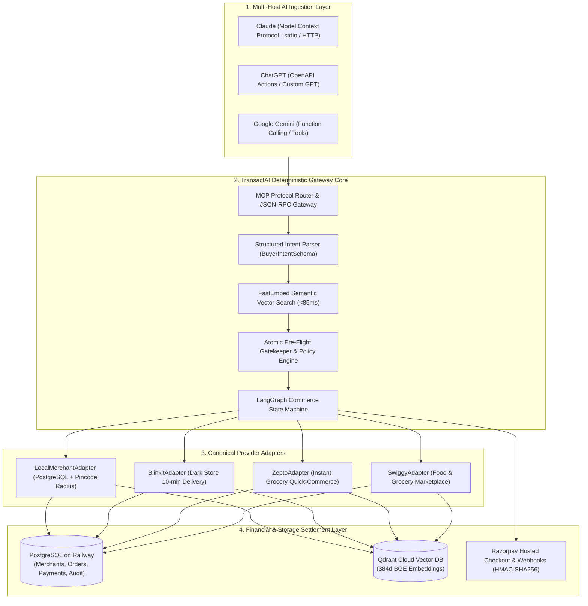
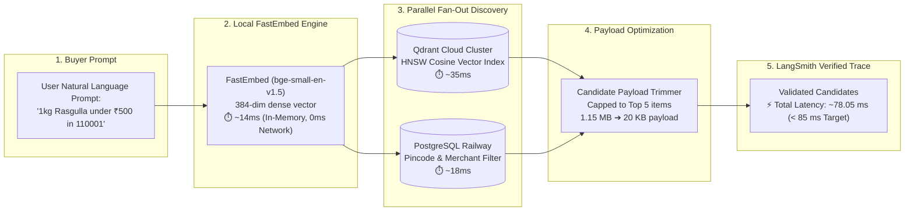
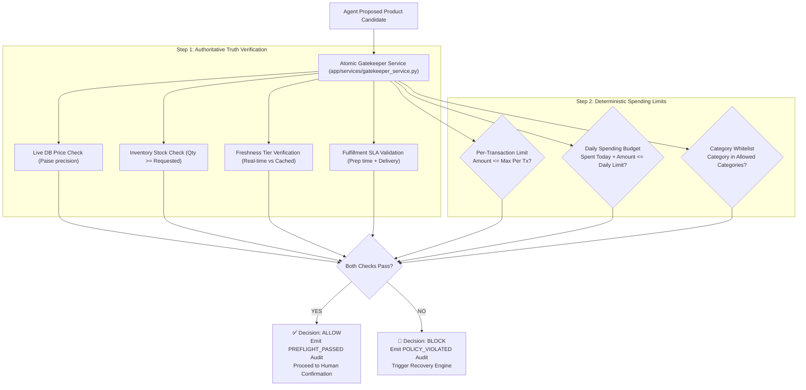
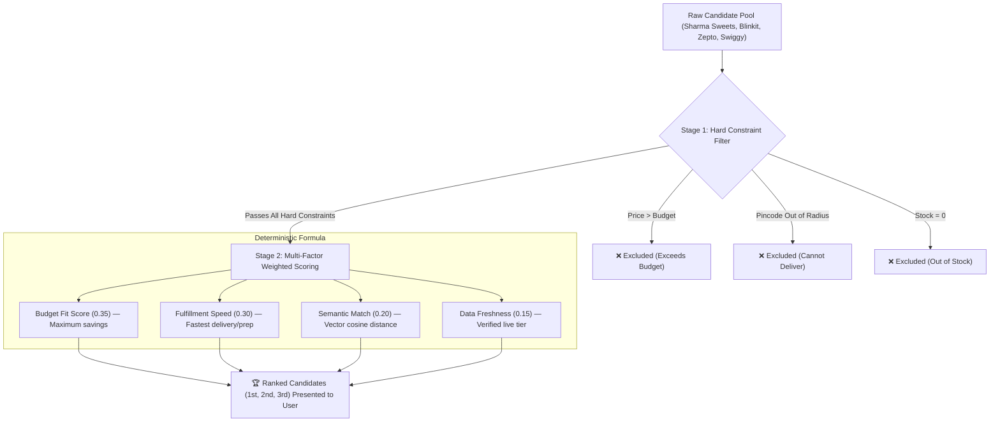
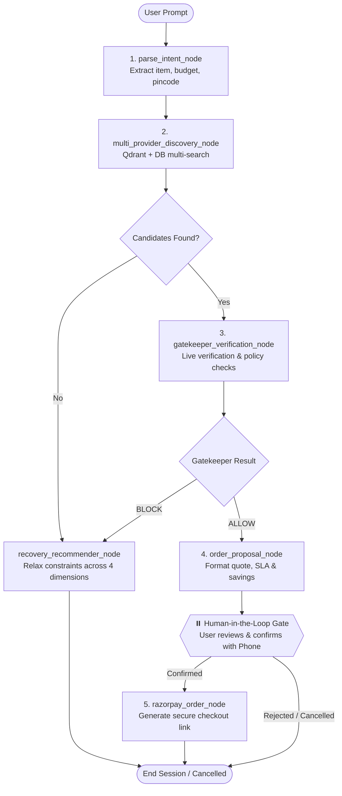
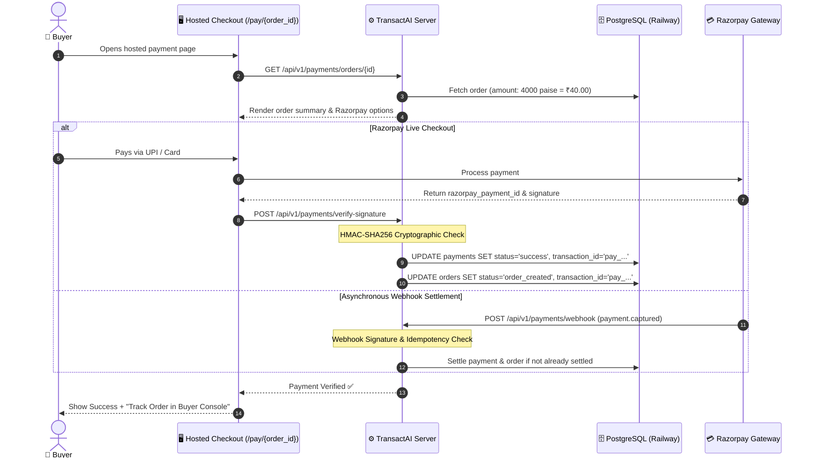
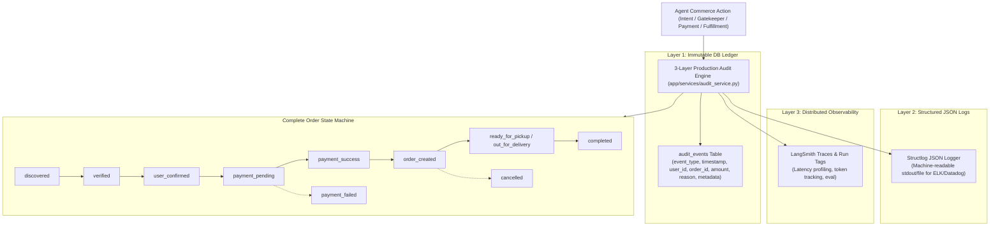
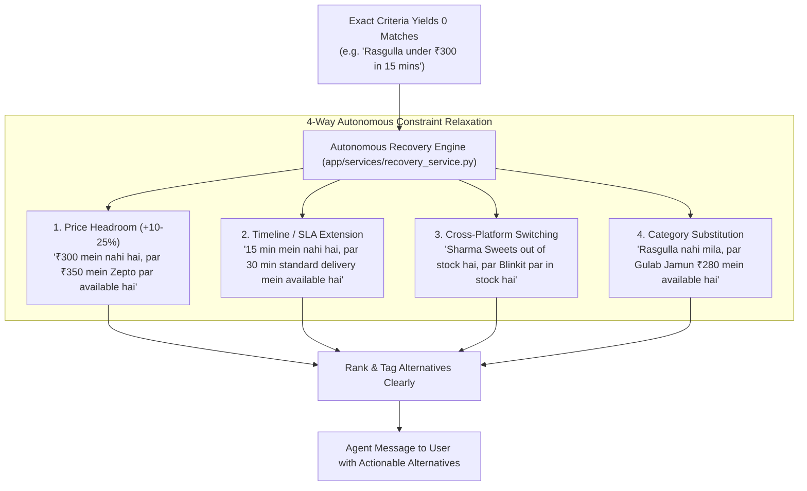
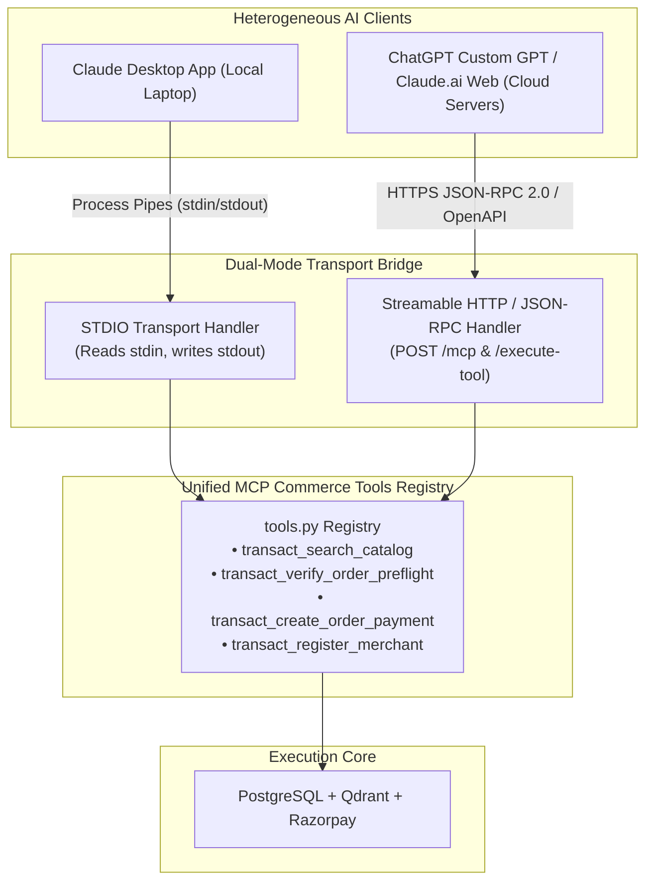
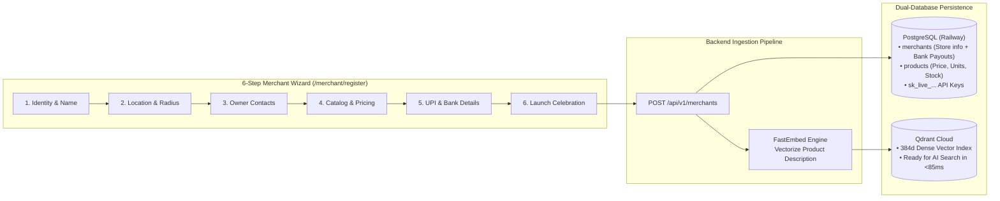

# 🏛️ TransactAI — Architecture Flowcharts & Visual System Blueprints

This document contains the complete collection of **10 production architectural flowcharts and system blueprints** for **TransactAI**. Each diagram models a critical subsystem—from multi-host protocol ingestion, sub-85ms vector discovery, and atomic gatekeeping to cryptographic payment settlements and 3-layer audit observability.

---

## 📑 Table of Contents

1. [Universal Autonomous Commerce Gateway Architecture](#1-universal-autonomous-commerce-gateway-architecture)
2. [<85ms Hybrid Semantic Vector Discovery Pipeline](#2-85ms-hybrid-semantic-vector-discovery-pipeline)
3. [Atomic Pre-Flight Gatekeeper & Spending Policy Engine](#3-atomic-pre-flight-gatekeeper--spending-policy-engine)
4. [Two-Stage Multi-Criteria Ranking Pipeline](#4-two-stage-multi-criteria-ranking-pipeline)
5. [Autonomous Commerce State Graph (LangGraph Execution)](#5-autonomous-commerce-state-graph-langgraph-execution)
6. [Razorpay Cryptographic Payment & Webhook Settlement Lifecycle](#6-razorpay-cryptographic-payment--webhook-settlement-lifecycle)
7. [3-Layer Audit Trail & Order Lifecycle Architecture](#7-3-layer-audit-trail--order-lifecycle-architecture)
8. [Multi-Dimensional Constraint Relaxation & Autonomous Recovery](#8-multi-dimensional-constraint-relaxation--autonomous-recovery)
9. [Dual-Mode Protocol Bridge: Local STDIO vs Remote Streamable HTTP](#9-dual-mode-protocol-bridge-local-stdio-vs-remote-streamable-http)
10. [Merchant Onboarding, FastEmbed Vectorization & Payout Pipeline](#10-merchant-onboarding-fastembed-vectorization--payout-pipeline)

---

## 1. Universal Autonomous Commerce Gateway Architecture

### 💡 Purpose & Core Invariants
Connects frontier conversational AI models (Claude, ChatGPT, Gemini) to real-world local merchants and quick-commerce providers without exposing raw databases or proprietary APIs. All external tool calls are normalized into a single canonical `ProductSchema`.

---

## 2. <85ms Hybrid Semantic Vector Discovery Pipeline

### 💡 Purpose & Core Invariants
In autonomous multi-turn shopping, compound agent latency must stay sub-100ms. By executing local in-memory embeddings via `FastEmbed` (`BAAI/bge-small-en-v1.5`) and parallelizing Qdrant Cloud HNSW vector searches with PostgreSQL relational lookups, TransactAI achieves a **78.05 ms** end-to-end trace. Trimming candidate payloads from 1.15 MB down to 20 KB eliminated state serialization bottlenecks.

---

## 3. Atomic Pre-Flight Gatekeeper & Spending Policy Engine

### 💡 Purpose & Core Invariants
Never permit an LLM to initiate payment on unverified inventory or exceed buyer-defined financial caps. The Pre-Flight Gatekeeper combines deterministic product truth verification with spending limit enforcement as an atomic pre-condition.

---

## 4. Two-Stage Multi-Criteria Ranking Pipeline

### 💡 Purpose & Core Invariants
Guarantees zero commercial bias. Hard constraints (budget cap, delivery radius, out of stock) immediately disqualify items regardless of rating or provider prominence. Surviving candidates are ranked using a multi-factor weighted scoring algorithm.

---

## 5. Autonomous Commerce State Graph (LangGraph Execution)

### 💡 Purpose & Core Invariants
Models the complete lifecycle of a transaction as a deterministic, typed state graph with state rollback, conditional branch routing, and a mandatory Human-in-the-Loop (HITL) gate before financial link creation.

---

## 6. Razorpay Cryptographic Payment & Webhook Settlement Lifecycle

### 💡 Purpose & Core Invariants
Financial transactions strictly use currency subunits (paise integers) to avoid floating-point drift. Double verification via client HMAC-SHA256 signature checking and asynchronous server webhooks ensures 100% settlement accuracy with idempotency keys.

---

## 7. 3-Layer Audit Trail & Order Lifecycle Architecture

### 💡 Purpose & Core Invariants
Provides full regulatory compliance, fraud prevention, and operational debugging by writing every agent action across three distinct observability tiers while transitioning the order through a strict finite state machine.

---

## 8. Multi-Dimensional Constraint Relaxation & Autonomous Recovery

### 💡 Purpose & Core Invariants
When an exact match fails (e.g. ₹300 budget in 15 mins), the agent never dead-ends. It automatically explores four orthogonal relaxation vectors to propose relevant, actionable alternatives.

---

## 9. Dual-Mode Protocol Bridge: Local STDIO vs Remote Streamable HTTP

### 💡 Purpose & Core Invariants
Bridges the architectural gap between local desktop agent processes (Claude Desktop via `stdio` pipes) and remote cloud-native assistants (ChatGPT Actions and Claude.ai Web via HTTPS JSON-RPC 2.0).

---

## 10. Merchant Onboarding, FastEmbed Vectorization & Payout Pipeline

### 💡 Purpose & Core Invariants
Allows non-technical physical merchants to register their store in under 3 minutes. The pipeline automatically persists store coordinates and bank/UPI settlement credentials into PostgreSQL while vectorizing catalog offerings into Qdrant Cloud.

---

*Authored for the TransactAI Open Source Project. All diagrams adhere to GitHub native Mermaid syntax.*
